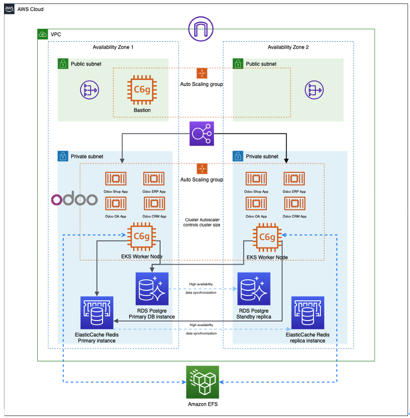

# Graviton2-based-ecommerence-solution

This is the code used for Graviton2-based-ecommerence-solution Workshop. Please find the detailed workshop guide [here](https://graviton2.awspsa.com/0_4.1-%E5%AE%9E%E9%AA%8C1%E9%80%9A%E8%BF%87cloudformation-%E6%A8%A1%E6%9D%BF%E9%83%A8%E7%BD%B2%E5%AE%9E%E9%AA%8C%E6%9E%B6%E6%9E%84.html). Or download the deployment guide [here](https://awspsa-quickstart.s3.cn-northwest-1.amazonaws.com.cn/public/AWS+Cloudformation%3A%E9%83%A8%E7%BD%B2%E6%8C%87%E5%8D%97.pdf).
Please find the detailed workshop demo [here](https://www.awspsa.com). 

 

## Prerequisites

To build and deploy this stack, please have the following tools installed. 

- AWS account
- aws-cli

You also need a DNS domain hosted on Route53. 

## Configuration

This stack use cloudformation file to provide configuration values. 

You can customize your parameters via cloudfromation console

## Deployment
You can jump to the cloudformation [launch console](https://console.aws.amazon.com/cloudformation/home?region=us-east-1#/stacks/new?stackName=Graviton2PartnerWorkshop&templateURL=https://awspsa-quickstart.s3.cn-northwest-1.amazonaws.com.cn/awspsa-odoo/templates/odoo-master.template)

## Clean up

Go to your cloudfromation console to delete ALL the resources deployed for this workshop, including the EKS，admin ec2 node， database, efs file system and redis cluster. 

## Security

See [CONTRIBUTING](CONTRIBUTING.md) for more information.

## Legal

During the launch of this Graviton2-based-ecommerence-solution, you will install software (and dependencies) on the Amazon EC2 instances launched in your account via stack creation. The software packages and/or sources you will install will be from the Amazon Linux distribution, as well as from third party sites.  Below is the list of such third party software, the source link, and the license link for each software. Please review and decide your comfort with installing these before continuing.  

### [Odoo community](https://www.odoo.com/)  
Source: [https://github.com/odoo/odoo] 

License: https://www.gnu.org/licenses/lgpl-3.0.en.html 

### [kubernetes](https://kubernetes.io)  
Source: [https://github.com/kubernetes/kubernetes/releases]

License: https://www.apache.org/licenses/LICENSE-2.0.html

### [CloudFormation](https://aws.amazon.com/cloudformation/)
Source: [https://github.com/aws-cloudformation/cfn-lint]

License: https://www.apache.org/licenses/LICENSE-2.0.html

### [wkhtmltopdf](https://wkhtmltopdf.org/)   
Source: [https://github.com/wkhtmltopdf/packaging/releases]

License: https://www.gnu.org/licenses/lgpl-3.0.en.html

## License

This library is licensed under the MIT-0 License. See the [LICENSE](LICENSE) file.

